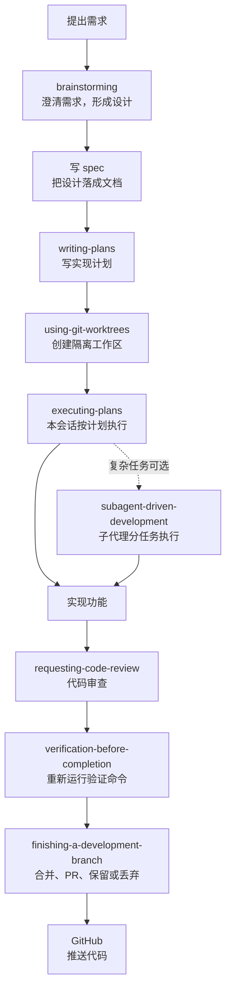

# superpowers-springboot-lab

这是一个用 Spring Boot 3 写的小型图书收藏 API。

不过它不只是一个普通 CRUD 练习。这个项目更像是一份“AI 编程流程练习册”：我们用它完整跑了一遍 Superpowers 工作流，从一个想法开始，经过需求澄清、写 spec、写 plan、创建 worktree、实现代码、代码审查、验证测试、合并分支，最后推到 GitHub。

如果你刚开始用 AI 写代码，这个项目最值得看的不是某一行 Java，而是这套流程：它能帮你少一点“AI 直接开写然后写偏了”的痛苦。

## Superpowers 是什么

你可以把 Superpowers 理解成一套“让 AI 编程更有章法”的工作流。

普通用法经常是这样：

```text
我：帮我加个接口
AI：好的，开始改代码
```

这很快，但也容易出问题。需求还没说清楚，AI 就已经开始写；写完以后你才发现接口响应格式不对、测试没覆盖、分支没隔离、代码也没 review。

Superpowers 想解决的就是这个问题。它把开发拆成一串比较稳的步骤：

```text
先弄清楚要做什么
再写设计文档
再写实现计划
再隔离分支开发
再验证和审查
最后合并或发布
```

它不是让流程变复杂，而是把容易出错的地方提前拦住。

## 我们用 Superpowers 跑过的一整套流程

这次项目里，我们大概按这个节奏走：

1. 先用 `brainstorming` 把想法说清楚
2. 写中文 spec，确认到底要做什么
3. 用 `writing-plans` 写 implementation plan
4. 用 `using-git-worktrees` 创建隔离 worktree
5. 用 `executing-plans` 按计划执行
6. 实现功能
7. 用 reviewer 子代理做规格审查和代码质量审查
8. 用 `verification-before-completion` 重新跑测试
9. 用 `finishing-a-development-branch` 合并或保留分支
10. 最后推送到 GitHub

如果任务比较复杂，也可以把第 5 步换成 `subagent-driven-development`，让子代理拆任务并行处理。它属于复杂任务的可选执行方式，不是你每天都要手动触发的主流程节点。

## 流程图



## 常见 skill 速查

Superpowers 不是所有 skill 都需要你手动点名。

更准确地说，skill 可以分成两类：用户经常直接触发的“主流程节点”，以及 Agent 在流程中自动或半自动调用的“辅助机制”。你不用一开始背完整列表，先知道它们分别处在开发流程的哪个位置就行。

| Skill | 作用 | 什么时候用 | 实际会做什么 |
| --- | --- | --- | --- |
| `brainstorming` | 把模糊想法变成清楚设计 | 新功能、改行为、写重要文档前 | 通过提问澄清目标、边界、取舍和验收标准，先把“想做什么”说清楚。 |
| `writing-plans` | 把 spec 拆成可执行计划 | 设计确认后、动手实现前 | 把需求拆成文件级步骤、测试点、验证命令和风险提示，形成可照着执行的 plan。 |
| `executing-plans` | 在当前会话按计划执行 | 想让 AI 一步步直接做 | 按 plan 逐项实现、阶段性检查结果，遇到偏差时停下来修正执行路线。 |
| `subagent-driven-development` | 派子代理分任务实现和审查 | 任务稍复杂、希望更稳时 | 把独立任务分给子代理并行处理，再汇总代码、审查结果和遗留问题。 |
| `requesting-code-review` | 请求代码审查 | 功能完成后、合并前 | 让另一个审查视角检查 bug、回归风险、遗漏测试和需求不匹配的地方。 |
| `verification-before-completion` | 完成前重新验证 | 说“完成”“通过”“可合并”之前 | 先运行能证明结果的命令，读完整输出，再根据证据判断是否真的完成。 |
| `finishing-a-development-branch` | 收尾分支 | 测试通过后，选择合并、PR、保留或丢弃 | 引导你选择下一步：合并、开 PR、保留分支，或丢弃实验性改动。 |
| `systematic-debugging` | 系统化调试 | 修 bug、排查测试失败或异常行为时 | 先复现问题、收集证据、验证假设，再决定怎么修，避免凭感觉改代码。 |
| `using-git-worktrees` | 创建隔离工作区 | 执行计划前，避免污染主分支 | 创建独立 worktree，在隔离目录里开发，减少和主分支或其他任务互相干扰。 |

## 1. 用户常用的主流程 skill

这些是你作为用户最常直接用的 skill。它们对应真实开发阶段：

```text
brainstorming
writing-plans
executing-plans
requesting-code-review
verification-before-completion
finishing-a-development-branch
systematic-debugging
```

一个比较顺手的口诀是：

```text
先聊清楚 -> 写设计 -> 写计划 -> 执行 -> 审查 -> 验证 -> 收尾
```

对应到 skill：

```text
brainstorming
-> writing-plans
-> executing-plans
-> requesting-code-review
-> verification-before-completion
-> finishing-a-development-branch
```

如果是在修 bug，中间通常会插入：

```text
systematic-debugging
```

它负责先定位问题、复现现象、验证假设，再进入修复，而不是看到报错就马上猜一个改法。

## 2. 半自动或内部辅助 skill

这些 skill 通常不是你主动点名，而是在主流程里被 Agent 用来保证执行更稳：

- `using-git-worktrees`
- `test-driven-development`
- `receiving-code-review`

### `using-git-worktrees`

这是执行前的隔离策略。

你一般不会一上来就说“使用 `using-git-worktrees`”。更常见的情况是：写完 plan 之后，准备执行之前，Agent 判断这次会改代码，于是自动创建一个隔离 worktree。

它解决的是一个很实际的问题：不要把实验性修改直接混在当前分支里。

### `test-driven-development`

如果 plan 里明确写了 TDD，执行阶段就会按这个方式走：先写失败测试，再实现功能，再让测试通过。

你也可以手动要求：

```text
这一步使用 test-driven-development。
```

但更多时候，它是执行计划的一部分，而不是一个单独的入口。

### `receiving-code-review`

这个通常配合 `requesting-code-review` 使用。

一个负责发起审查，另一个负责接收、理解和处理审查意见。重点不是“审查说什么都照做”，而是判断反馈是否准确、是否需要改、改完后是否还要重新验证。

所以看到一个 skill 时，先不要问“我要不要手动点它”，而是先问：

```text
它是一个开发阶段，还是一个辅助机制？
```

例如：

```text
writing-plans = 开发阶段
using-git-worktrees = 辅助机制
```

这个判断很重要。它能帮你把 Superpowers 当成一套流程来用，而不是把它误解成一堆需要全部记住的命令。

## 新手使用建议

如果你刚开始用 Superpowers，我建议先记住这些：

1. 不要一上来就让 AI 写代码  
   先让它用 `brainstorming` 问清楚需求。

2. 重要需求一定写 spec  
   spec 不是官样文章，它是防止 AI 写偏的锚点。

3. 写代码前先写 plan  
   plan 能把“大任务”拆成小任务，也方便审查。

4. 不要迷信“看起来没问题”  
   用 `verification-before-completion` 重新跑命令，用结果说话。

5. 合并前要 code review  
   就算是 AI 写的，也要让另一个视角检查一遍。

6. 学会问“下一步应该用哪个 skill”  
   这很有用，能帮你把流程接上，不会做到一半乱掉。

## 新手常见问题 Q&A

### Q：spec 和 plan 有什么区别？

spec 说的是“要做什么”和“做到什么程度算对”。它更像需求说明，会写清楚目标、边界、接口行为、错误情况和不做什么。

plan 说的是“怎么一步步做”。它会把 spec 拆成具体执行步骤，比如要改哪些文件、先写哪些测试、每一步怎么验证。

简单说：

```text
spec = 定义目标
plan = 拆解做法
```

### Q：为什么要先 `brainstorming`？

因为很多需求一开始都是模糊的。

比如你说“加一个查询接口”，AI 可能不知道成功响应长什么样、找不到数据时返回什么、要不要分页、要不要排序。如果直接写代码，很容易写快了但写偏了。

`brainstorming` 的作用就是先把这些问题问清楚。它不是为了拖慢开发，而是为了避免后面返工。

### Q：`writing-plans` 是做什么的？

`writing-plans` 会把已经确认的 spec 变成实施计划。

它通常会回答这些问题：

- 这次要改哪些文件
- 先做哪一步，后做哪一步
- 哪些地方需要测试
- 用什么命令验证
- 哪些风险点要特别注意

对新手来说，plan 的价值是让任务从“一大坨要改的东西”变成“可以一项一项执行的小步骤”。

### Q：`executing-plans` 是做什么的？

`executing-plans` 是按 plan 真正开始执行。

它会根据计划修改代码、补测试、运行验证命令，并在遇到问题时回到计划里调整。你可以把它理解成“照着施工图施工”。

如果 `writing-plans` 是写路线图，那么 `executing-plans` 就是沿着路线图开工。

### Q：为什么 `using-git-worktrees` 会自动出现？

因为它是执行前的隔离机制。

当 Agent 判断这次会改代码时，可能会自动使用 `using-git-worktrees` 创建一个独立工作区。这样做的好处是：当前分支可以保持干净，实验性修改也不会直接混进主工作区。

你不一定需要手动点它。很多时候它会出现在 `writing-plans` 之后、真正执行之前。

### Q：worktree 是不是完整复制项目？

不是简单意义上的“复制一整份项目”。

Git worktree 会给你一个新的工作目录，里面看起来像一份完整项目：有代码文件、可以运行命令、可以单独切分支。但它底层复用同一个 Git 仓库的数据，不是把 `.git` 历史完整复制一遍。

对使用者来说，可以先这样理解：

```text
worktree = 另一个独立工作目录
```

它适合用来同时处理多个分支或多个任务，互相不容易打架。

### Q：代码写完后为什么还要 `requesting-code-review`？

因为“代码能跑”不等于“代码真的稳”。

`requesting-code-review` 会换一个审查视角看改动，重点检查：

- 有没有漏掉 spec 要求
- 有没有行为回归
- 错误处理是否合理
- 测试是否覆盖关键路径
- 代码是否有维护风险

这一步不是为了挑刺，而是为了在合并前多一道保险。

### Q：`verification-before-completion` 和 `mvn test` 是什么关系？

`mvn test` 是一个具体的验证命令。

`verification-before-completion` 是一个流程要求：在你说“完成了”“测试通过了”“可以合并了”之前，必须先运行能证明这件事的命令，并认真看输出。

在这个 Spring Boot 项目里，最常用的验证命令就是：

```bash
mvn test
```

所以它们的关系可以理解成：

```text
verification-before-completion = 完成前必须验证
mvn test = 本项目里最常用的验证方式
```

### Q：`finishing-a-development-branch` 的 4 个选项是什么意思？

功能做完、验证通过后，还要决定这个分支怎么收尾。常见有 4 个选择：

| 选项 | 意思 |
| --- | --- |
| 合并 | 把当前分支的改动合回主分支，适合已经确认要保留的功能。 |
| 开 PR | 推到 GitHub 并创建 Pull Request，适合需要别人 review 或走团队流程的改动。 |
| 保留分支 | 暂时不合并，留下来继续观察、补充或以后再处理。 |
| 丢弃分支 | 这次只是实验或方向不对，不保留这些改动。 |

它的重点不是“必须合并”，而是提醒你：开发完成后，要明确选择下一步，不要让分支和改动一直悬在那里。

## 用本项目举个完整例子

### 例子一：从零做图书收藏 API

一开始我们不是直接写 Java，而是先写了中文 spec：

- 要做一个图书收藏 API
- 使用 Spring Boot 3
- 使用 H2 做本地持久化
- 用 MockMvc 做集成测试
- 第一阶段不做登录、分页、搜索、Docker

然后写 implementation plan，把工作拆成：

- 初始化 Maven 项目
- 实现创建图书
- 实现列表查询
- 实现标记已读
- 实现删除图书
- 补充错误处理
- 跑全量测试

实现时我们用了 worktree，避免直接在 `main` 上改。完成后做了代码审查、测试验证，再合并回 `main`，最后推送到 GitHub。

### 例子二：新增 `GET /api/books/{id}`

后来我们又加了一个接口：

```text
GET /api/books/{id}
```

这次需求看起来很小，但 Superpowers 仍然要求先澄清。

我们先确认了一个关键点：成功响应复用现有 `BookResponse`。

然后写 spec，明确：

- id 存在时返回 `200 OK`
- id 不存在时返回 `404 Not Found`
- 错误响应继续使用：

```json
{
  "message": "Book not found"
}
```

接着写 plan，再用 `subagent-driven-development` 执行：

- Task 1：改 `BookService` 和 `BookController`
- Task 2：补 MockMvc 测试
- 每个 Task 后都做规格审查和代码质量审查
- 最后跑 `mvn test`
- 合并回 `main`

这个例子说明：即使只是一个小接口，也可以用很轻量的 spec 和 plan 把事情做稳。

## 项目当前 API

| 方法 | 路径 | 说明 |
| --- | --- | --- |
| `POST` | `/api/books` | 创建一本收藏图书 |
| `GET` | `/api/books` | 查询所有收藏图书 |
| `GET` | `/api/books/{id}` | 根据 id 查询单本图书 |
| `PATCH` | `/api/books/{id}/read` | 将图书标记为已读 |
| `DELETE` | `/api/books/{id}` | 删除一本收藏图书 |

## 本地运行与测试

运行测试：

```bash
mvn test
```

这个命令会运行 MockMvc 集成测试，验证 API 的主要行为，包括：

- 创建图书
- 标题校验
- 查询列表
- 根据 id 查询单本图书
- 标记已读
- 删除图书
- 404 错误响应

如果测试通过，说明当前 API 的核心行为是稳定的。

## 最后一句

Superpowers 的重点不是“多几个步骤”，而是让 AI 编程从随手一改，变成有设计、有计划、有验证、有收尾。

对于小项目，它能帮你养成好习惯；对于大项目，它能救命。
